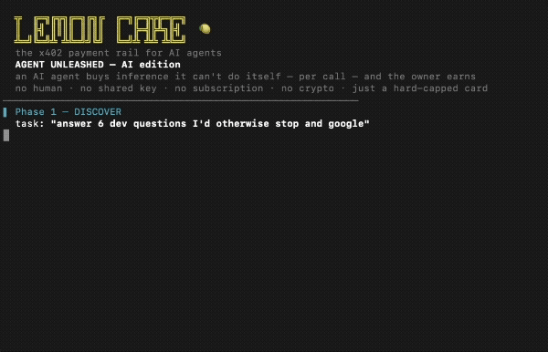

# 🍋 Agent Unleashed

**I gave an AI agent a hard-capped card and let it loose. It pays for paid API calls on its own — and stops when the money's gone.**

What it buys is **paid LLM inference it can't do itself** (a regex, a SQL query, a git command) — behind someone else's API key. No human in the loop. No shared key. **No crypto** — the wallet is a hard-capped prepaid card (Stripe), not USDC.



```
  ╦  ╔═╗╔╦╗╔═╗╔╗╔  ╔═╗╔═╗╦╔═╔═╗
  ║  ║╣ ║║║║ ║║║║  ║  ╠═╣╠╩╗║╣   🍋
  ╩═╝╚═╝╩ ╩╚═╝╝╚╝  ╚═╝╩ ╩╩ ╩╚═╝
  the x402 payment rail for AI agents
  AGENT UNLEASHED — AI edition
────────────────────────────────────────────────────────────
▌ Phase 1 — DISCOVER
  task: "answer 6 dev questions I'd otherwise stop and google"
  🔎 found a paid AI tool via MCP:  ai-answer  (…/g/<id>)
     a dev's LLM endpoint · pay-per-call (x402) · the seller's key, not mine
────────────────────────────────────────────────────────────
▌ Phase 2 — BUDGET
  💳 funding a hard-capped prepaid wallet (Stripe card — not crypto)…
  agent wallet (LemonCake Pay Token): $0.50 / daily cap $5
  → $0.50 ÷ $0.01/call = up to 50 inference calls
  [▓▓▓▓▓▓▓▓▓▓▓▓▓▓▓▓▓▓] $0.50
  policy: within cap → approved · it physically can't overspend
────────────────────────────────────────────────────────────
▌ Phase 3 — PAY  (autonomous · each answer is a paid LLM call · the owner gets paid each time)
  → regex   agent paid $0.01 → 💰 owner earned $0.0097   [▓▓▓▓▓▓▓▓▓▓▓▓▓▓▓▓▓▓] $0.49
       ↳ AI: ^[a-zA-Z0-9._%+-]+@[a-zA-Z0-9.-]+\.[a-zA-Z]{2,}$
  → SQL     agent paid $0.01 → 💰 owner earned $0.0097   [▓▓▓▓▓▓▓▓▓▓▓▓▓▓▓▓▓░] $0.47
       ↳ AI: SELECT c.customer_name, SUM(o.order_total) AS total_revenue FROM…
  → git     agent paid $0.01 → 💰 owner earned $0.0097   [▓▓▓▓▓▓▓▓▓▓▓▓▓▓▓▓░░] $0.45
       ↳ AI: git reset --soft HEAD~1
  …
────────────────────────────────────────────────────────────
▌ Phase 4 — RESULT
  buyer:  6 AI calls · spent $0.06 of the $5 cap · hard-capped, can't run away
  seller: 💰 your AI endpoint earned $0.0582 — auto-collected, no invoice
  at scale: $0.01/call × 10,000 agent calls/day ≈ $97/day
  no human · no shared key · no subscription · no crypto · you keep 97%
```

## Why this is different

Most "agents pay for APIs" demos settle in **USDC on-chain** — the agent needs a crypto wallet.

This one doesn't. The agent spends a **hard-capped prepaid card** behind [LemonCake](https://lemoncake.xyz)'s x402 gateway:

- **x402-native** — the API returns `402 + accepts[]`; the agent pays and retries, no human.
- **Hard-capped** — per-mint / daily / monthly limits, enforced server-side. The agent *cannot* overspend.
- **Custody-free, fiat** — Stripe Connect Direct Charge. No chain, no token, no wallet seed. The seller keeps 97%.
- **Not free data** — what's bought is real paid LLM inference (the seller's key/compute is the product).

So any developer with a Stripe account — not just crypto-native ones — can let agents pay per call.

## Run it

You need a LemonCake **Buyer Key** scoped to your AI endpoint, with a saved card
(issue one at [/app](https://lemoncake.xyz/app) → Pay Tokens, save a card at [/agent/fund](https://lemoncake.xyz/agent/fund)).
The endpoint wraps an OpenAI-compatible chat API (e.g. OpenRouter) — your model key goes in the endpoint's
upstream-auth field, never to the agent.

```bash
BK=bk_your_key EP=<shortId> MODEL=meta-llama/llama-3.3-70b-instruct node agent-ai.mjs
```

Options:

```bash
BASE=https://www.lemoncake.xyz   # gateway
FUND_CENTS=50                    # how much to fund this task (Stripe min $0.50)
MODEL=meta-llama/llama-3.3-70b-instruct   # any model the upstream serves
CALL_DELAY_MS=700                # pacing for a clean recording
MAX_CALLS=6                      # keep the demo short
JWT=<existing pay token>         # reuse a funded token instead of minting (no new charge)
```

> The FX-data variant (`agent-unleashed.mjs`) shows the same rail against a GET data API.

## How it maps to LemonCake

| Demo step | LemonCake mechanic |
|---|---|
| discover a paid tool | x402 `402 + accepts[]` (buyUrl + mintUrl) |
| fund a capped wallet | `POST /api/lc/agent/tokens` → Stripe charge → Pay Token (JWT) |
| pay per call | `POST /g/<shortId>` with `Authorization: Bearer <jwt>` (seller's upstream key injected server-side) |
| can't overspend | per-mint / daily / monthly caps, server-enforced |
| owner earns | 97% to the seller per call, auto-collected (100% for the first 3,000) |

## Monetize your own model/API

Put any HTTP API or LLM endpoint behind a pay-per-call x402 gateway in minutes — no code changes:

1. Add your API at [lemoncake.xyz/app](https://lemoncake.xyz/app), set a price, paste your upstream key (stays server-side).
2. Share the gateway URL `/g/<shortId>`.
3. Agents pay per call, you keep 97%, first 3,000 calls free.

→ [lemoncake.xyz](https://lemoncake.xyz) · [agent-payment-mcp on npm](https://www.npmjs.com/package/agent-payment-mcp)

## License

MIT
